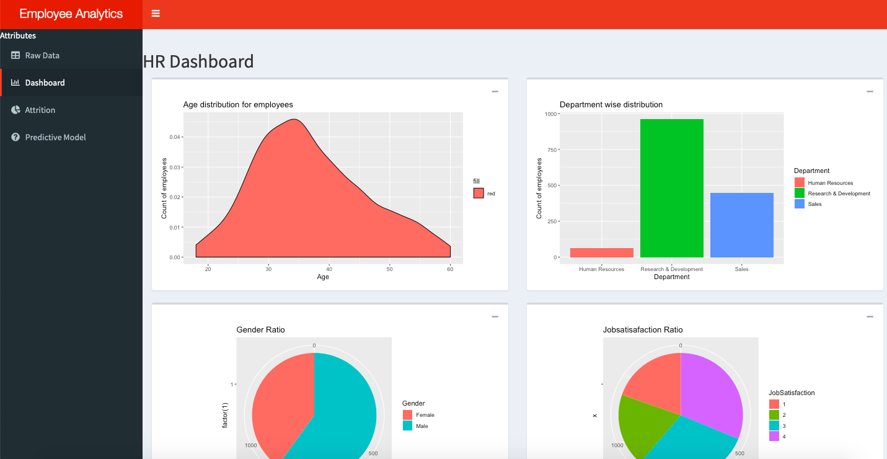

# HR-Analytics-Dashboard-Rshiny
This is a template to make HR analytics dashboard app using shiny package in R.

## Libraries used:
ggplot2

plotly

shiny

shinydashboard

DT

DBI

## Dataset Used:
Watson_Analytics IBM Sample data

## Sample Screenshot

